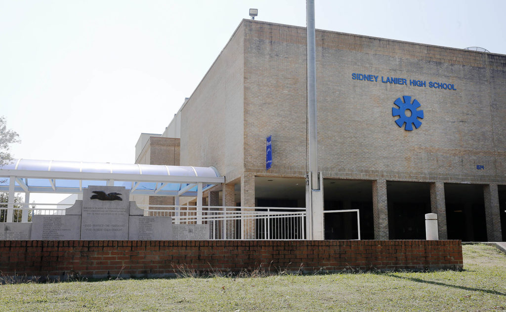

_This is the fourth and final installment in a series of essays on the legacy of Rodriguez v. San Antonio ISD — a court battle that began in San Antonio and ended in the Supreme Court — and determined that American children have no constitutional right to an education. Read the [first][1], [second][2] and [third][3] essays._

In 1968, Bexar County Commissioner A.J. Plough sat down with CBS News to discuss the plight of Latinos living in hunger and poverty on San Antonio's West Side.

**Plough: "**Well, why are they not getting enough food? Because the father won't work. And I mean, won't work. If they won't work, do you expect the taxpayer to raise all the kids … 'cause their daddies won't work? First, let's do something with the daddies and then, yes, take care of the kids.

The reporter asked how chronically hungry students could be expected to learn on an empty stomach.

"Well, what do you mean learn properly in school? Do you really need school… other than, say, an eighth grade education?" Plough said, later adding, "People keep talking about this education, 'a college education.' It's not necessary."

Meanwhile, the same disparities that prompted the CBS interview caught the attention of the United States Commission on Civil Rights, which held hearings that same year in San Antonio to collect information regarding civil rights violations against Mexican-American families in the Southwest. What they found reveals how racism shaped society in the 20th century here and across the United States.

In total, the commission spent six months in San Antonio and interviewed more than 1,000 residents to understand these challenges in the context of housing, education, employment, voting and justice.

Contrary to the analysis of Plough and others, the Commission found that Hispanic parents desperately wanted good jobs, their children wanted to earn college degrees, and both wanted to eat three meals a day in decent housing. However, the education system and public infrastructure failed them. Parents faced discrimination in the workplace. Their upward mobility was further restricted by exclusionary real estate and lending practices. Using [racially restrictive housing covenants][2] white residents prohibited Black and Hispanic families from purchasing homes in multiple neighborhoods across the city. Such was unvarnished racism in mid-century America. Discrimination was not problematic, and equity was not a priority.

As a result of these attitudes, economic development, which increased property values and neighborhood resources, was unevenly distributed. Until 1977, San Antonio's City Council was entirely made up of members who could live anywhere in the city, and the Northside was most heavily represented. Major investments like the South Texas Medical Center and the University of Texas at San Antonio directed the city's continued growth to the north. Meanwhile, the parts of town where black and Hispanic families were contained — the East, West and South Sides — were further devalued by neglect of aging and absent infrastructure.

Political, economic and social exclusion worked in concert to create an intractable disadvantage that still clings to the heels of ambitious and bright Hispanic students decades later. While few in 2017 would espouse overt racism, the damning testimony recorded by the Civil Rights commission has yet to be fully rectified.

```{r fig.cap="Figure from [Folo Media](https://folomedia.org). The Thiry Fine Arts Building at Our Lady of the Lake University was the site of the 1968 hearings of the United States Commission on Civil Rights. **Tomas Gonzalez / Special to Folo Media**", out.extra="class=external", layout="l-body-outset"}
knitr::include_graphics("thiry-1024x682.jpg")
```

### **_Eres sucio_**

At around 7 p.m. on Dec. 10, 1968, five students reported to Our Lady of the Lake's Thiry Auditorium to give their testimonies before the United States Commission on Civil Rights.

The students were from Lanier High School in San Antonio ISD and Edgewood High School in Edgewood ISD. Both schools had disproportionately large Mexican-American populations — the result of housing segregation in the city over the past century. Exclusive neighborhoods began to crop up around downtown beginning in the late 19th century, with "suburbs" like Dignowity Hill and districts like King William. In the 1930s as the city expanded, exclusivity was codified by restrictive neighborhood covenants and discriminatory lending practices by the Federal Housing Administration.

In the heavily Hispanic areas of town, schools reflected this segregation. The teachers and administration in these schools, the students said, had taken it upon themselves to rid them of their "dirty" culture.

When they spoke to the Commission, each student recounted instances of corporal punishment administered by teachers or administrators for speaking Spanish. Though family, friends and classmates served in the military, paid taxes and contributed to the community in other ways, students had been told their culture was dirty and that their ancestors contributed nothing to America. Routinely, staff explained they needed to be better Americans.

From Edgar Lozano, who was a junior at Lanier:

"If they caught you talking Spanish, they would send you to  the office and give you a warning. They would give you a long lecture about, if you wanted to be an American, you have got to speak English. And you were not a very good American, and all that, and Spanish isn't your language, you know; that is in Mexico. So you are an American. You speak English."

Many students wanted better jobs than their parents — who had been limited to low-wage work — but students were repeatedly told to focus on vocational courses like wood-working or homemaking. If they had no interest in vocational work, they were provided opportunities to meet with military recruiters.

College was a world away as far as they were concerned. If they asked about it, school counselors reminded them they wouldn't finish high school. Unlike schools in the northern part of the city, career days at Edgewood or Lanier did not include doctors and lawyers. Instead, convicted criminals were brought in as guest speakers to give motivational speeches discouraging them from lives of crime.

In the days before government subsidized free or reduced-rate lunches, most students endured their mistreatment on an empty stomach.

Shortly after Lozano started elementary school on San Antonio's West Side in the 1950s, he wanted to get his teacher's attention one morning but didn't know how. Born in Mexico and brought to the city as a child, Lozano only spoke Spanish. The school had no classes or lessons for students trying to learn English.

"I called her 'Ma'am,'" Lozano told the commission, "because I heard somebody else say 'Ma'am,' and she turned around and she gave me a belt right in the mouth. I mean, she knocked me down."

"Stupid, the word is Madame," she told him.

Later, a teacher overhead Lozano studying for his Spanish class. She assumed he was speaking Spanish socially, and reported him to the administration. Speaking to the commission, Lozano recounted what happened in the administrator's office:

"I told them what had happened, and he said: 'Now, don't give me that.'

And I said: 'Well, you know, I don't want to be hit anymore.'

And he said: 'No, no, no, no, we are going to fix you up right. You are going to learn English.' So he hit me again."

Lozano estimated to the panel that the administrator had hit him at least five times that school year — every time for speaking Spanish.

"How would you like for somebody to come up to you and tell you what you speak is a dirty language?" Lozano asked the panel.

### **History class**

History class was the other tool teachers used to rid students of their Mexican identity. Highlighting white heroes in Texas and U.S. history, schools neglected to mention Mexican-American contributions to Texas or American history.

Excluded were basic facts, like the long history of Spanish Texas or that three signers of the state's Declaration of Independence had been Mexican (one of whom [served as its first Vice President][5]).

Despite watching countless family and friends leave for war and never come home, students at Lanier and Edgewood (as well as other Texas schools) also never heard of Mexican-Americans who contributed to America during World War II, the Korean War or Vietnam. By 1968, more than a dozen of the state's Hispanic soldiers received Congressional Medals of Honor.

Collectively, the denigration of their language, history and culture left students void of identity.

In his testimony before the Civil Rights commission, Lozano lamented: "… in my 12 years in school I have never learned what I am. My history, I don't know that. I don't exactly know what to call myself."

```{r fig.cap="Figure from [Folo Media](https://folomedia.org). In 1968, students from Lanier High School were among those interviewed by the United States Commission on Civil Rights. **Tomas Gonzalez / Special to Folo Media**", out.extra="class=external", layout="l-body-outset"}

```

### **Resistance**

In April and May 1968, the students at Lanier and Edgewood organized mass walkouts. At Lanier, roughly 700 students and community members protested. At Edgewood, 400 students walked out after the 10 a.m. bell. The students presented their administrations with a list of grievances and demanded better course offerings and college counseling, which at Edgewood was limited to a select few. Staff offered help with grants and admissions applications, but only for those they deemed likely to succeed. Discreetly, staff would pull individual students out of class and direct them to the cafeteria for information sessions.

Diana Herrera was not selected.

After learning that counsellors were intentionally keeping this program quiet, she marched to the front office in protest.

"I demanded to know why my name was not on the list, because I was going to go," Herrera told Folo Media in August. College was part of her plan, but the Edgewood counsellors didn't see it that way.

"The counseling department immediately interrupted me, said I was not going to college, and that I would — and I remember the words: 'You're going to marry Richard and have children.'"

Herrera went on to become an educator in Edgewood for many years; she now works in the community on behalf of Edgewood with groups like the Intercultural Development Research Association.

<iframe width="560" height="315" src="https://www.youtube.com/embed/lArMfXvxk5Y" frameborder="0" allow="accelerometer; autoplay; encrypted-media; gyroscope; picture-in-picture" allowfullscreen></iframe>

### **What (hasn't) changed**

In 2017, some might like to think the days described by Lozano and Herrera are far behind — that characters like Plough are contained in the pages of folk history of "back when we were racist."

While many of the overt offenses are gone and explicitly racist language is less socially acceptable, the structural inequities remain. A new generation has taken up the causes of the Civil Rights era in attempts to complete what was begun half a century ago.

Students are no longer beaten for speaking Spanish. In fact, dual-language programs have become a premium service, most commonly available in well-funded districts. Ironically, while students who speak Spanish at home might thrive in a dual-language program, [they often do not get the chance][7]. Like advanced placement and college preparatory courses, dual-language programs are more readily available in property wealthy districts, or in the wealthier schools within large districts. Over the past two years, SAISD has become a notable local exception to this disparity by opening [11 new dual language academies in majority-Hispanic neighborhoods][8].

Southside, Harlandale and Southwest ISDs have two-way bilingual programs which combine native speakers of Spanish and English to help both groups become bilingual.

History curriculum has also seen uneven progress. Fine arts programs in San Antonio celebrate mariachi and muralist traditions, but traditional academic coursework is still in the hands of the state.

In 2014, the Texas State Board of Education put out a call for text books on Mexican-American studies. Even though the Texas Education Agency reports that 52.4 percent of Texas school children are Hispanic, the state still groups Mexican-American studies under "ethnic studies," an elective available to high school students. It has resisted efforts to create a standalone Mexican-American studies course.

```{r fig.cap="Figure from [Folo Media](https://folomedia.org).", fig.align='center', out.extra="class=external"}
knitr::include_graphics("Screen-Shot-2017-12-06-at-3.44.58-PM-e1512597184705.png")
```

The first submission for the contract, ["Mexican-American Heritage,"][10] was widely reviled by history scholars, Hispanic lawmakers and Latino activists. It implied that Mexican-Americans were non-committal toward the U.S. and that the Chicano movement of the Civil Rights era espoused a "revolutionary narrative that opposed Western civilization and wanted to destroy this society."

Last month, a second submission by activist Tony Diaz was rejected by the State Board of Education. While the board claimed the text did not meet curricular standards for social studies, critics have said the failure to find an appropriate text book marks a lack of commitment to Mexican-American studies as a whole.

It should be noted that Houston ISD recently adopted its own Mexican-American history curriculum, which scholars say is far more accurate and respectful than any effort by the state so far.

The testimonies from the 1968 Civil Rights commission echo in other challenges currently faced by Hispanic students.

In April 2016, a group of community activists, rallied by San Antonio City Councilman Rey Saldaña, gathered to address ongoing frustration with South San ISD.

Ivy League universities and other competitive schools are now focusing on recruiting Hispanic scholars. Saldaña himself is an alum of 98 percent-Hispanic South San High School and went on to Stanford University for his bachelor's and master's degrees.

Nonetheless, South San High School 2016 valedictorian Araceli Garcia told the South San activists that a teacher at her high school had advised her not to bother applying to out of state schools, and chastised her for applying to the University of Southern California, saying that it would be too expensive for her parents. Garcia did not identify the teacher, and said that she was not the only member of her class to be dissuaded from such ambitions.

Garcia went on to list other inadequacies — in particular, classes without textbooks, teachers who would not help students apply for scholarships — at South San, which, in 2016, had recently come under sanction from the state.

Property values remain a critical piece of school finance, as Saldaña knows, and Hispanic-majority communities continue to lag behind areas with more diversity. Leaders like Saldaña have pursued economic development for the South, West and East Sides, but development on the Northside is decades ahead, benefiting from a virtuous cycle of investment.

"People just believe it's in the best interest of building a great city to keep the bad things out of sight of the nice areas," Saldaña said, "and conversely the nice things need to continue to go in the nice areas, parks, highways to more growth, etc."

The mixed progress toward equitable education for Hispanic students reflects the fundamental flaw at the heart of education in Texas: The system was built with a bias, from the curriculum down to the funding mechanisms. When Center for Public Policy Priorities analyst Chandra Villanueva describes the Texas school finance system, she uses the metaphor of an old house with a patchwork of repairs where full renovation is needed instead.

While the Texas Supreme Court ruled in May 2016 that the school finance system was, in fact, constitutional, it did not give the funding mechanisms and legislation glowing reviews. In the court's 100-page opinion, Justice Don Willett called the system "Byzantine."

"Shortfalls in both resources and performance persist in innumerable respects, and a perilously large number of students is in danger of falling further behind," wrote Justice Eva Guzman in her concurring opinion.

Neither the U.S. Supreme Court, nor the Texas Supreme Court, went so far as to connect the inadequacies and inequalities of the school finance system to the explicit racism experienced by Texas students.

Likewise, Villanueva does not usually comment on the racial inequity laid into the foundation of the house. However, she told Folo that the excessively complicated formulas and half-hearted fixes are telltale signs of this deeper problem.

"When you develop a school finance system that's based on local property values at the exact same time that you're explicitly segregating neighborhoods on race, then you can't act surprised 50 years later — 70 years later — when things are unequal," Villanueva said. "It was very intentional the way that we set up school districts and funding at a time when it was OK to be explicitly racist. And we are experiencing the fallout from that system."

[1]: https://www.folomedia.org/americans-no-right-education/
[2]: https://www.folomedia.org/san-antonio-segregated-schools/
[3]: https://www.folomedia.org/san-antonio-left-edgewood-fend/
[5]: https://tshaonline.org/handbook/online/articles/fza05
[7]: https://www.usnews.com/news/national-news/articles/2017-07-31/rising-popularity-of-dual-language-education-could-leave-latinos-behind
[8]: https://www.saisd.net/main/index.php?option=com_content&view=article&id=6594&Itemid=0
[10]: https://media.click2houston.com/document_dev/2016/09/06/Mexican%20American%20History%20-%20Watermark_1473193071370_7947711_ver1.0.pdf

## Acknowledgments {.appendix}

This article was produced during my time at Folo Media during 2017. Folo Media was a nonprofit newsroom focused on the challenges of inequity and neighborhood segregation in San Antonio, Texas. The newsroom ran from the spring of 2017 through early 2018, and during that span published more than 100 stories covering a range of issues, such as: housing, education, racial segregation, non-profit solutions, and much more.

If you are interested in following the work of those who helped lead Folo Media's work, I encourage you to keep up with [the American Journalism Project](http://www.theajp.org), [the H.E.Butt Foundation's *Echoes* Magazine](https://echoes.hebfdn.org), and [the San Antonio Heron](https://saheron.com).

