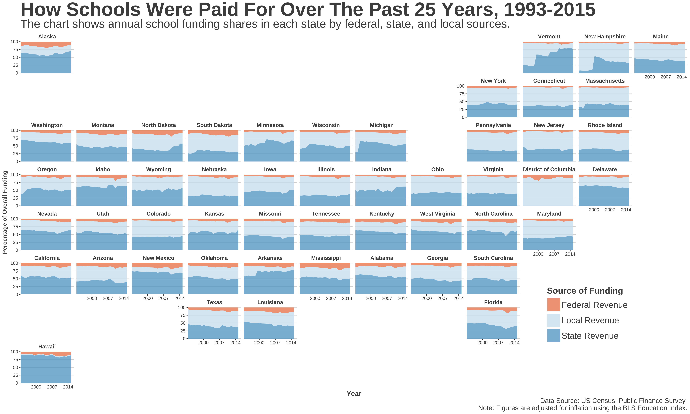

```{r setup, include=FALSE}
knitr::opts_chunk$set(
  echo = TRUE,
  warning = TRUE,
  message = TRUE,
  comment = "##",
  R.options = list(width = 60)
)
library(tidyverse)
library(readxl)
library(geofacet)
library(ggthemes)
library(showtext)
```

This evening, [the Ed Trust is hosting a discussion on twitter at 8PM ET](https://edtrust.org/resource/funding-gaps-2018/) on school funding inequity, so I thought I would do a code-through of a visualization I made this past summer while researching the legacy of a famous school finance Supreme Court case that ended up determining that [Americans had no fundamental right to an education](https://www.folomedia.org/americans-no-right-education/). In short, it shows the shares of funding over time for each of the three main sources of funding for public education in America: federal funding, state funding, and local funding (mostly property taxes).

# Why Visualize School Finance?

In recent years, much has been debated about school funding, or the lack thereof. Notably, recent studies coming out of places like [Texas A&M](https://www.texastribune.org/2018/03/28/texas-am-lori-taylor-public-education-funding/) and [the US Commission on Civil Rights](http://usccr.gov/pubs/2018-01-10-Education-Inequity.pdf) have highlighted funding deficits throughout America that not only threaten the futures of currently enrolled public school students, but [our future economies](https://www.texastribune.org/2018/03/20/texas-notice-credit-rating-downgrade-comptroller-says/) throughout America.

You may not have children, but school finance impacts you regardless. And as one news executive said recently in a visit to one of my public policy classes, "school finance is the thing people should be talking about but will likely never get talked about."

So here's to helping people understand with clean visualizations. Alright, let's see the map and get to the code-through.

### The Map

```{r echo=FALSE, layout="l-page"}

```

# The Code Through

While we'll visualize the three sources of funding, this dataset will organize a few other data points of use. While I'll do my best to address what each one is, I may overlook a few variables. If I do, you can reach out to me or reach out to the folks at the Census' Educational Finance Branch.

### Accessing All the Data Used Here

For this code-through, [you can download all the data used for this code-through from my github](https://github.com/mrworthington/fileshare/raw/master/sf-data.zip), which includes the inflation & state "FIPS" code data needed for the visualization to work properly. Just add it to whatever directory you're working out of and you'll be good to go.

### Import School Finance Data

While you already have the data, the US Census has been collecting data from every school district in the country since the 1960s. Using their FTP database, you can download the files here and other various datasets related to public finance. For our purposes, we'll use their elementary and secondary school finance survey files and start from 1993 for a couple of reasons explained by clicking on the tooltips here[^1] [^2].

[^1]: Before 1992, the method of collection for the census didn't disaggregate federal revenues from state revenues because federal dollars were technically implemented through the state. However, since 1992, the census shifted their reporting protocols for states and began requesting that each state delineate between their contributions versus what the federal government provided.
  
[^2]: While this method of collection started in 1992, our analysis will start in 1993 because that is when [the Bureau of Labor & Statistics introduced their Education Inflation Index](https://data.bls.gov/cgi-bin/surveymost?cu), which was meant to provide clarity on a dollar's value in the education space.
  
To access this raw data, you can go to the US Census FTP database where the school finance datasets are stored and download them into a folder there. First, [go to the FTP database](ftp://ftp.census.gov/govs/school/). Second, choose "Allow" when prompted and select guest when asked for authentication.

<aside>
  
</aside>
  
  Once you do this, you should see a dialogue showing your connection status that looks like this.

<aside>
  
</aside>

After the data downloads into the remote disk, find the files with the following labels highlighted in purple below (i.e., `"elsec.93.xls"`) and download them into a folder called "data". Once you do that, save a .Rproj file into the same location and you'll be able to run the code below without much trouble (I hope).

One note about my code. By no means am I an expert in R and when I produced this code, I knew way less about the `tidyverse` than I do now. If any other R folks have feedback, I'm 100% open to ways I can make this code cleaner and more efficient.

```{r, eval=FALSE, echo=TRUE}

setwd("data/")

#Import Census School Finance Data
sf1993 <- read_excel("elsec93.xls")
sf1994 <- read_excel("elsec94.xls")
sf1995 <- read_excel("elsec95.xls")
sf1996 <- read_excel("elsec96.xls")
sf1997 <- read_excel("elsec97.xls")
sf1998 <- read_excel("elsec98.xls")
sf1999 <- read_excel("elsec99.xls")
sf2000 <- read_excel("elsec00.xls")
sf2001 <- read_excel("elsec01.xls")
sf2002 <- read_excel("elsec02.xls")
sf2003 <- read_excel("elsec03.xls")
sf2004 <- read_excel("elsec04.xls")
sf2005 <- read_excel("elsec05.xls")
sf2006 <- read_excel("elsec06.xls")
sf2007 <- read_excel("elsec07.xls")
sf2008 <- read_excel("elsec08.xls")
sf2009 <- read_excel("elsec09.xls")
sf2010 <- read_excel("elsec10.xls")
sf2011 <- read_excel("elsec11.xls")
sf2012 <- read_excel("elsec12.xls")
sf2013 <- read_excel("elsec13.xls")
sf2014 <- read_excel("elsec14.xls")
sf2015 <- read_excel("elsec15.xls")

#Add YEAR Column, No M/D
sf1993$YEAR <- as.character("1993")
sf1994$YEAR <- as.character("1994")
sf1995$YEAR <- as.character("1995")
sf1996$YEAR <- as.character("1996")
sf1997$YEAR <- as.character("1997")
sf1998$YEAR <- as.character("1998")
sf1999$YEAR <- as.character("1999")
sf2000$YEAR <- as.character("2000")
sf2001$YEAR <- as.character("2001")
sf2002$YEAR <- as.character("2002")
sf2003$YEAR <- as.character("2003")
sf2004$YEAR <- as.character("2004")
sf2005$YEAR <- as.character("2005")
sf2006$YEAR <- as.character("2006")
sf2007$YEAR <- as.character("2007")
sf2008$YEAR <- as.character("2008")
sf2009$YEAR <- as.character("2009")
sf2010$YEAR <- as.character("2010")
sf2011$YEAR <- as.character("2011")
sf2012$YEAR <- as.character("2012")
sf2013$YEAR <- as.character("2013")
sf2014$YEAR <- as.character("2014")
sf2015$YEAR <- as.character("2015")
```

### Import Inflation Data and Tidy The Data

At this part, we're limiting the raw data to the revenue sources, along with a few other identifiers and more granular funding sources that will get accounted into the larger buckets of Federal, State, & Local revenues but are interesting to see in our table nonetheless.

```{r, eval=FALSE, echo=TRUE, R.options = list(width = 60)}
#Introduce Inflation
inflation <- read_csv("data/inflation.csv", col_types = cols(YEAR_S = col_character()))

#Select Only Those Variables of Interest
t1993 <- dplyr::select(sf1993, one_of(c("STATE", "ID", "YEAR", "NAME", "SCHLEV", "V33", "TOTALREV", "TFEDREV", "TSTREV","TLOCREV", "T06", "U97", "TOTALEXP", "TCURELSC")))
t1994 <- dplyr::select(sf1994, one_of(c("STATE", "IDCENSUS", "YEAR", "NAME", "SCHLEV", "V33", "TOTALREV", "TFEDREV", "TSTREV","TLOCREV", "T06", "U97", "TOTALEXP", "TCURELSC")))
t1995 <- dplyr::select(sf1995, one_of(c("STATE", "IDCENSUS", "YEAR", "NAME", "SCHLEV", "V33", "TOTALREV", "TFEDREV", "TSTREV","TLOCREV", "T06", "U97", "TOTALEXP", "TCURELSC")))
t1996 <- dplyr::select(sf1996, one_of(c("STATE", "IDCENSUS", "YEAR", "NAME", "SCHLEV", "V33", "TOTALREV", "TFEDREV", "TSTREV","TLOCREV", "T06", "U97", "TOTALEXP", "TCURELSC")))
t1997 <- dplyr::select(sf1997, one_of(c("STATE", "IDCENSUS", "YEAR", "NAME", "SCHLEV", "V33", "TOTALREV", "TFEDREV", "TSTREV","TLOCREV", "T06", "U97", "TOTALEXP", "TCURELSC")))
t1998 <- dplyr::select(sf1998, one_of(c("STATE", "IDCENSUS", "YEAR", "NAME", "SCHLEV", "V33", "TOTALREV", "TFEDREV", "TSTREV","TLOCREV", "T06", "U97", "TOTALEXP", "TCURELSC")))
t1999 <- dplyr::select(sf1999, one_of(c("STATE", "IDCENSUS", "YEAR", "NAME", "SCHLEV", "V33", "TOTALREV", "TFEDREV", "TSTREV","TLOCREV", "T06", "U97", "TOTALEXP", "TCURELSC")))
t2000 <- dplyr::select(sf2000, one_of(c("STATE", "IDCENSUS", "YEAR", "NAME", "SCHLEV", "V33", "TOTALREV", "TFEDREV", "TSTREV","TLOCREV", "T06", "U97", "TOTALEXP", "TCURELSC")))
t2001 <- dplyr::select(sf2001, one_of(c("STATE", "IDCENSUS", "YEAR", "NAME", "SCHLEV", "V33", "TOTALREV", "TFEDREV", "TSTREV","TLOCREV", "T06", "U97", "TOTALEXP", "TCURELSC")))
t2002 <- dplyr::select(sf2002, one_of(c("STATE", "IDCENSUS", "YEAR", "NAME", "SCHLEV", "V33", "TOTALREV", "TFEDREV", "TSTREV","TLOCREV", "T06", "U97", "TOTALEXP", "TCURELSC")))
t2003 <- dplyr::select(sf2003, one_of(c("STATE", "IDCENSUS", "YEAR", "NAME", "SCHLEV", "V33", "TOTALREV", "TFEDREV", "TSTREV","TLOCREV", "T06", "U97", "TOTALEXP", "TCURELSC")))
t2004 <- dplyr::select(sf2004, one_of(c("STATE", "IDCENSUS", "YEAR", "NAME", "SCHLEV", "V33", "TOTALREV", "TFEDREV", "TSTREV","TLOCREV", "T06", "U97", "TOTALEXP", "TCURELSC")))
t2005 <- dplyr::select(sf2005, one_of(c("STATE", "IDCENSUS", "YEAR", "NAME", "SCHLEV", "V33", "TOTALREV", "TFEDREV", "TSTREV","TLOCREV", "T06", "U97", "TOTALEXP", "TCURELSC")))
t2006 <- dplyr::select(sf2006, one_of(c("STATE", "IDCENSUS", "YEAR", "NAME", "SCHLEV", "V33", "TOTALREV", "TFEDREV", "TSTREV","TLOCREV", "T06", "U97", "TOTALEXP", "TCURELSC")))
t2007 <- dplyr::select(sf2007, one_of(c("STATE", "IDCENSUS", "YEAR", "NAME", "SCHLEV", "V33", "TOTALREV", "TFEDREV", "TSTREV","TLOCREV", "T06", "U97", "TOTALEXP", "TCURELSC")))
t2008 <- dplyr::select(sf2008, one_of(c("STATE", "IDCENSUS", "YEAR", "NAME", "SCHLEV", "V33", "TOTALREV", "TFEDREV", "TSTREV","TLOCREV", "T06", "U97", "TOTALEXP", "TCURELSC")))
t2009 <- dplyr::select(sf2009, one_of(c("STATE", "IDCENSUS", "YEAR", "NAME", "SCHLEV", "V33", "TOTALREV", "TFEDREV", "TSTREV","TLOCREV", "T06", "U97", "TOTALEXP", "TCURELSC")))
t2010 <- dplyr::select(sf2010, one_of(c("STATE", "IDCENSUS", "YEAR", "NAME", "SCHLEV", "V33", "TOTALREV", "TFEDREV", "TSTREV","TLOCREV", "T06", "U97", "TOTALEXP", "TCURELSC")))
t2011 <- dplyr::select(sf2011, one_of(c("STATE", "IDCENSUS", "YEAR", "NAME", "SCHLEV", "V33", "TOTALREV", "TFEDREV", "TSTREV","TLOCREV", "T06", "U97", "TOTALEXP", "TCURELSC")))
t2012 <- dplyr::select(sf2012, one_of(c("STATE", "IDCENSUS", "YEAR", "NAME", "SCHLEV", "V33", "TOTALREV", "TFEDREV", "TSTREV","TLOCREV", "T06", "U97", "TOTALEXP", "TCURELSC")))
t2013 <- dplyr::select(sf2013, one_of(c("STATE", "IDCENSUS", "YEAR", "NAME", "SCHLEV", "V33", "TOTALREV", "TFEDREV", "TSTREV","TLOCREV", "T06", "U97", "TOTALEXP", "TCURELSC")))
t2014 <- dplyr::select(sf2014, one_of(c("STATE", "IDCENSUS", "YEAR", "NAME", "SCHLEV", "V33", "TOTALREV", "TFEDREV", "TSTREV","TLOCREV", "T06", "U97", "TOTALEXP", "TCURELSC")))
t2015 <- dplyr::select(sf2015, one_of(c("STATE", "IDCENSUS", "YEAR", "NAME", "SCHLEV", "V33", "TOTALREV", "TFEDREV", "TSTREV","TLOCREV", "T06", "U97", "TOTALEXP", "TCURELSC")))
```

### Recode Additional Variables of Interest

Truth be told, many databases use strange identifiers to identify what those variables represent. In the census dataset, they used some names that are easy to interpret at first glance. For instance, `TOTALREV` equals "Total Revenue". However, some variables aren't easily interpretable. For my purposes, I wanted to create more readable names for some of the variables I pulled in earlier. This code does that. 

```{r, eval=FALSE, echo=TRUE, R.options = list(width = 60)}

#Recode 1993 Variables
t1993 <- rename(t1993,  
                ENROLL = V33,
                IDCENSUS = ID,
                PROPTAX = T06,
                MISCREV = U97)

#Recode 1994 Variables
t1994 <- rename(t1994,  
                ENROLL = V33,
                PROPTAX = T06,
                MISCREV = U97)

#Recode 1995 Variables
t1995 <- rename(t1995,  
                ENROLL = V33,
                PROPTAX = T06,
                MISCREV = U97)

#Recode 1996 Variables
t1996 <- rename(t1996,  
                ENROLL = V33,
                PROPTAX = T06,
                MISCREV = U97)

#Recode 1997 Variables
t1997 <- rename(t1997,  
                ENROLL = V33,
                PROPTAX = T06,
                MISCREV = U97)

#Recode 1998 Variables
t1998 <- rename(t1998,  
                ENROLL = V33,
                PROPTAX = T06,
                MISCREV = U97)

#Recode 1999 Variables
t1999 <- rename(t1999,  
                ENROLL = V33,
                PROPTAX = T06,
                MISCREV = U97)

#Recode 2000 Variables
t2000 <- rename(t2000,  
                ENROLL = V33,
                PROPTAX = T06,
                MISCREV = U97)

#Recode 2001 Variables
t2001 <- rename(t2001,  
                ENROLL = V33,
                PROPTAX = T06,
                MISCREV = U97)

#Recode 2002 Variables
t2002 <- rename(t2002,  
                ENROLL = V33,
                PROPTAX = T06,
                MISCREV = U97)

#Recode 2003 Variables
t2003 <- rename(t2003,  
                ENROLL = V33,
                PROPTAX = T06,
                MISCREV = U97)

#Recode 2004 Variables
t2004 <- rename(t2004,  
                ENROLL = V33,
                PROPTAX = T06,
                MISCREV = U97)

#Recode 2005 Variables
t2005 <- rename(t2005,  
                ENROLL = V33,
                PROPTAX = T06,
                MISCREV = U97)
#Recode 2006 Variables
t2006 <- rename(t2006,  
                ENROLL = V33,
                PROPTAX = T06,
                MISCREV = U97)

#Recode 2007 Variables
t2007 <- rename(t2007,  
                ENROLL = V33,
                PROPTAX = T06,
                MISCREV = U97)

#Recode 2008 Variables
t2008 <- rename(t2008,  
                ENROLL = V33,
                PROPTAX = T06,
                MISCREV = U97)

#Recode 2009 Variables
t2009 <- rename(t2009,  
                ENROLL = V33,
                PROPTAX = T06,
                MISCREV = U97)

#Recode 2010 Variables
t2010 <- rename(t2010,  
                ENROLL = V33,
                PROPTAX = T06,
                MISCREV = U97)

#Recode 2011 Variables
t2011 <- rename(t2011,  
                ENROLL = V33,
                PROPTAX = T06,
                MISCREV = U97)

#Recode 2012 Variables
t2012 <- rename(t2012,  
                ENROLL = V33,
                PROPTAX = T06,
                MISCREV = U97)

#Recode 2013 Variables
t2013 <- rename(t2013,  
                ENROLL = V33,
                PROPTAX = T06,
                MISCREV = U97)

#Recode 2014 Variables
t2014 <- rename(t2014,  
                ENROLL = V33,
                PROPTAX = T06,
                MISCREV = U97)

#Recode 2015 Variables
t2015 <- rename(t2015,  
                ENROLL = V33,
                PROPTAX = T06,
                MISCREV = U97)

inflation <- rename(inflation, 
                    INDEX = Index,
                    YEAR = YEAR_S)
```

### Add The BLS Education Inflation Index

Here, we're combining the inflation data from [the BLS Education Inflation Index](https://data.bls.gov/cgi-bin/surveymost?cu) alongside their annual counterparts from the census files so we can multiply the index value by each year's recorded funding amount. Once we do that, we'll have our inflation adjusted figures and be able to visualize them. 

```{r, eval=FALSE, echo=TRUE, R.options = list(width = 60)}
#Add Inflation Index
inflation <- inflation %>% as_tibble() %>% mutate(
  Annual = NULL)
t1993 <- left_join(t1993, inflation, by ="YEAR")
t1994 <- left_join(t1994, inflation, by ="YEAR")
t1995 <- left_join(t1995, inflation, by ="YEAR")
t1996 <- left_join(t1996, inflation, by ="YEAR")
t1997 <- left_join(t1997, inflation, by ="YEAR")
t1998 <- left_join(t1998, inflation, by ="YEAR")
t1999 <- left_join(t1999, inflation, by ="YEAR")
t2000 <- left_join(t2000, inflation, by ="YEAR")
t2001 <- left_join(t2001, inflation, by ="YEAR")
t2002 <- left_join(t2002, inflation, by ="YEAR")
t2003 <- left_join(t2003, inflation, by ="YEAR")
t2004 <- left_join(t2004, inflation, by ="YEAR")
t2005 <- left_join(t2005, inflation, by ="YEAR")
t2006 <- left_join(t2006, inflation, by ="YEAR")
t2007 <- left_join(t2007, inflation, by ="YEAR")
t2008 <- left_join(t2008, inflation, by ="YEAR")
t2009 <- left_join(t2009, inflation, by ="YEAR")
t2010 <- left_join(t2010, inflation, by ="YEAR")
t2011 <- left_join(t2011, inflation, by ="YEAR")
t2012 <- left_join(t2012, inflation, by ="YEAR")
t2013 <- left_join(t2013, inflation, by ="YEAR")
t2014 <- left_join(t2014, inflation, by ="YEAR")
t2015 <- left_join(t2015, inflation, by ="YEAR")

```


### Adjust Our Data for Inflation

As mentioned before, we'll be using data from [the Bureau of Labor & Statistics' Education Inflation Index](https://data.bls.gov/cgi-bin/surveymost?cu) to calculate our inflation adjusted figures.

```{r, eval=FALSE, echo=TRUE, R.options = list(width = 60)}

t1993e <- t1993 %>% as_tibble() %>% mutate(
  TOTALREVe = TOTALREV*IndexED,
  TFEDREVe = TFEDREV*IndexED,
  TSTREVe = TSTREV*IndexED,
  TLOCREVe = TLOCREV*IndexED,
  PROPTAXe = PROPTAX*IndexED,
  MISCREVe = MISCREV*IndexED,
  TOTALEXPe = TOTALEXP*IndexED,
  TCURELSCe = TCURELSC*IndexED)

t1994e <- t1994 %>% as_tibble() %>% mutate(
  TOTALREVe = TOTALREV*IndexED,
  TFEDREVe = TFEDREV*IndexED,
  TSTREVe = TSTREV*IndexED,
  TLOCREVe = TLOCREV*IndexED,
  PROPTAXe = PROPTAX*IndexED,
  MISCREVe = MISCREV*IndexED,
  TOTALEXPe = TOTALEXP*IndexED,
  TCURELSCe = TCURELSC*IndexED)

t1995e <- t1995 %>% as_tibble() %>% mutate(
  TOTALREVe = TOTALREV*IndexED,
  TFEDREVe = TFEDREV*IndexED,
  TSTREVe = TSTREV*IndexED,
  TLOCREVe = TLOCREV*IndexED,
  PROPTAXe = PROPTAX*IndexED,
  MISCREVe = MISCREV*IndexED,
  TOTALEXPe = TOTALEXP*IndexED,
  TCURELSCe = TCURELSC*IndexED)

t1996e <- t1996 %>% as_tibble() %>% mutate(
  TOTALREVe = TOTALREV*IndexED,
  TFEDREVe = TFEDREV*IndexED,
  TSTREVe = TSTREV*IndexED,
  TLOCREVe = TLOCREV*IndexED,
  PROPTAXe = PROPTAX*IndexED,
  MISCREVe = MISCREV*IndexED,
  TOTALEXPe = TOTALEXP*IndexED,
  TCURELSCe = TCURELSC*IndexED)

t1997e <- t1997 %>% as_tibble() %>% mutate(
  TOTALREVe = TOTALREV*IndexED,
  TFEDREVe = TFEDREV*IndexED,
  TSTREVe = TSTREV*IndexED,
  TLOCREVe = TLOCREV*IndexED,
  PROPTAXe = PROPTAX*IndexED,
  MISCREVe = MISCREV*IndexED,
  TOTALEXPe = TOTALEXP*IndexED,
  TCURELSCe = TCURELSC*IndexED)

t1998e <- t1998 %>% as_tibble() %>% mutate(
  TOTALREVe = TOTALREV*IndexED,
  TFEDREVe = TFEDREV*IndexED,
  TSTREVe = TSTREV*IndexED,
  TLOCREVe = TLOCREV*IndexED,
  PROPTAXe = PROPTAX*IndexED,
  MISCREVe = MISCREV*IndexED,
  TOTALEXPe = TOTALEXP*IndexED,
  TCURELSCe = TCURELSC*IndexED)

t1999e <- t1999 %>% as_tibble() %>% mutate(
  TOTALREVe = TOTALREV*IndexED,
  TFEDREVe = TFEDREV*IndexED,
  TSTREVe = TSTREV*IndexED,
  TLOCREVe = TLOCREV*IndexED,
  PROPTAXe = PROPTAX*IndexED,
  MISCREVe = MISCREV*IndexED,
  TOTALEXPe = TOTALEXP*IndexED,
  TCURELSCe = TCURELSC*IndexED)

t2000e <- t2000 %>% as_tibble() %>% mutate(
  TOTALREVe = TOTALREV*IndexED,
  TFEDREVe = TFEDREV*IndexED,
  TSTREVe = TSTREV*IndexED,
  TLOCREVe = TLOCREV*IndexED,
  PROPTAXe = PROPTAX*IndexED,
  MISCREVe = MISCREV*IndexED,
  TOTALEXPe = TOTALEXP*IndexED,
  TCURELSCe = TCURELSC*IndexED)

t2001e <- t2001 %>% as_tibble() %>% mutate(
  TOTALREVe = TOTALREV*IndexED,
  TFEDREVe = TFEDREV*IndexED,
  TSTREVe = TSTREV*IndexED,
  TLOCREVe = TLOCREV*IndexED,
  PROPTAXe = PROPTAX*IndexED,
  MISCREVe = MISCREV*IndexED,
  TOTALEXPe = TOTALEXP*IndexED,
  TCURELSCe = TCURELSC*IndexED)


t2002e <- t2002 %>% as_tibble() %>% mutate(
  TOTALREVe = TOTALREV*IndexED,
  TFEDREVe = TFEDREV*IndexED,
  TSTREVe = TSTREV*IndexED,
  TLOCREVe = TLOCREV*IndexED,
  PROPTAXe = PROPTAX*IndexED,
  MISCREVe = MISCREV*IndexED,
  TOTALEXPe = TOTALEXP*IndexED,
  TCURELSCe = TCURELSC*IndexED)

t2003e <- t2003 %>% as_tibble() %>% mutate(
  TOTALREVe = TOTALREV*IndexED,
  TFEDREVe = TFEDREV*IndexED,
  TSTREVe = TSTREV*IndexED,
  TLOCREVe = TLOCREV*IndexED,
  PROPTAXe = PROPTAX*IndexED,
  MISCREVe = MISCREV*IndexED,
  TOTALEXPe = TOTALEXP*IndexED,
  TCURELSCe = TCURELSC*IndexED)

t2004e <- t2004 %>% as_tibble() %>% mutate(
  TOTALREVe = TOTALREV*IndexED,
  TFEDREVe = TFEDREV*IndexED,
  TSTREVe = TSTREV*IndexED,
  TLOCREVe = TLOCREV*IndexED,
  PROPTAXe = PROPTAX*IndexED,
  MISCREVe = MISCREV*IndexED,
  TOTALEXPe = TOTALEXP*IndexED,
  TCURELSCe = TCURELSC*IndexED)

t2005e <- t2005 %>% as_tibble() %>% mutate(
  TOTALREVe = TOTALREV*IndexED,
  TFEDREVe = TFEDREV*IndexED,
  TSTREVe = TSTREV*IndexED,
  TLOCREVe = TLOCREV*IndexED,
  PROPTAXe = PROPTAX*IndexED,
  MISCREVe = MISCREV*IndexED,
  TOTALEXPe = TOTALEXP*IndexED,
  TCURELSCe = TCURELSC*IndexED)

t2006e <- t2006 %>% as_tibble() %>% mutate(
  TOTALREVe = TOTALREV*IndexED,
  TFEDREVe = TFEDREV*IndexED,
  TSTREVe = TSTREV*IndexED,
  TLOCREVe = TLOCREV*IndexED,
  PROPTAXe = PROPTAX*IndexED,
  MISCREVe = MISCREV*IndexED,
  TOTALEXPe = TOTALEXP*IndexED,
  TCURELSCe = TCURELSC*IndexED)

t2007e <- t2007 %>% as_tibble() %>% mutate(
  TOTALREVe = TOTALREV*IndexED,
  TFEDREVe = TFEDREV*IndexED,
  TSTREVe = TSTREV*IndexED,
  TLOCREVe = TLOCREV*IndexED,
  PROPTAXe = PROPTAX*IndexED,
  MISCREVe = MISCREV*IndexED,
  TOTALEXPe = TOTALEXP*IndexED,
  TCURELSCe = TCURELSC*IndexED)

t2008e <- t2008 %>% as_tibble() %>% mutate(
  TOTALREVe = TOTALREV*IndexED,
  TFEDREVe = TFEDREV*IndexED,
  TSTREVe = TSTREV*IndexED,
  TLOCREVe = TLOCREV*IndexED,
  PROPTAXe = PROPTAX*IndexED,
  MISCREVe = MISCREV*IndexED,
  TOTALEXPe = TOTALEXP*IndexED,
  TCURELSCe = TCURELSC*IndexED)

t2009e <- t2009 %>% as_tibble() %>% mutate(
  TOTALREVe = TOTALREV*IndexED,
  TFEDREVe = TFEDREV*IndexED,
  TSTREVe = TSTREV*IndexED,
  TLOCREVe = TLOCREV*IndexED,
  PROPTAXe = PROPTAX*IndexED,
  MISCREVe = MISCREV*IndexED,
  TOTALEXPe = TOTALEXP*IndexED,
  TCURELSCe = TCURELSC*IndexED)

t2010e <- t2010 %>% as_tibble() %>% mutate(
  TOTALREVe = TOTALREV*IndexED,
  TFEDREVe = TFEDREV*IndexED,
  TSTREVe = TSTREV*IndexED,
  TLOCREVe = TLOCREV*IndexED,
  PROPTAXe = PROPTAX*IndexED,
  MISCREVe = MISCREV*IndexED,
  TOTALEXPe = TOTALEXP*IndexED,
  TCURELSCe = TCURELSC*IndexED)

t2011e <- t2011 %>% as_tibble() %>% mutate(
  TOTALREVe = TOTALREV*IndexED,
  TFEDREVe = TFEDREV*IndexED,
  TSTREVe = TSTREV*IndexED,
  TLOCREVe = TLOCREV*IndexED,
  PROPTAXe = PROPTAX*IndexED,
  MISCREVe = MISCREV*IndexED,
  TOTALEXPe = TOTALEXP*IndexED,
  TCURELSCe = TCURELSC*IndexED)

t2012e <- t2012 %>% as_tibble() %>% mutate(
  TOTALREVe = TOTALREV*IndexED,
  TFEDREVe = TFEDREV*IndexED,
  TSTREVe = TSTREV*IndexED,
  TLOCREVe = TLOCREV*IndexED,
  PROPTAXe = PROPTAX*IndexED,
  MISCREVe = MISCREV*IndexED,
  TOTALEXPe = TOTALEXP*IndexED,
  TCURELSCe = TCURELSC*IndexED)

t2013e <- t2013 %>% as_tibble() %>% mutate(
  TOTALREVe = TOTALREV*IndexED,
  TFEDREVe = TFEDREV*IndexED,
  TSTREVe = TSTREV*IndexED,
  TLOCREVe = TLOCREV*IndexED,
  PROPTAXe = PROPTAX*IndexED,
  MISCREVe = MISCREV*IndexED,
  TOTALEXPe = TOTALEXP*IndexED,
  TCURELSCe = TCURELSC*IndexED)

t2014e <- t2014 %>% as_tibble() %>% mutate(
  TOTALREVe = TOTALREV*IndexED,
  TFEDREVe = TFEDREV*IndexED,
  TSTREVe = TSTREV*IndexED,
  TLOCREVe = TLOCREV*IndexED,
  PROPTAXe = PROPTAX*IndexED,
  MISCREVe = MISCREV*IndexED,
  TOTALEXPe = TOTALEXP*IndexED,
  TCURELSCe = TCURELSC*IndexED)

t2015e <- t2015 %>% as_tibble() %>% mutate(
  TOTALREVe = TOTALREV*IndexED,
  TFEDREVe = TFEDREV*IndexED,
  TSTREVe = TSTREV*IndexED,
  TLOCREVe = TLOCREV*IndexED,
  PROPTAXe = PROPTAX*IndexED,
  MISCREVe = MISCREV*IndexED,
  TOTALEXPe = TOTALEXP*IndexED,
  TCURELSCe = TCURELSC*IndexED)


```

### Merge All Datasets Into One

At this point, once each of our individual datasets that are adjusted for inflation are compiled, we can merge them into one single dataset that is one step closer to being visualized.

```{r, eval=FALSE, echo=TRUE, R.options = list(width = 60)}
full.94e <- bind_rows(t1993e, t1994e)
full.95e <- bind_rows(full.94e, t1995e)
full.96e <- bind_rows(full.95e, t1996e)
full.97e <- bind_rows(full.96e, t1997e)
full.98e <- bind_rows(full.97e, t1998e)
full.99e <- bind_rows(full.98e, t1999e)
full.00e <- bind_rows(full.99e, t2000e)
full.01e <- bind_rows(full.00e, t2001e)
full.02e <- bind_rows(full.01e, t2002e)
full.03e <- bind_rows(full.02e, t2003e)
full.04e <- bind_rows(full.03e, t2004e)
full.05e <- bind_rows(full.04e, t2005e)
full.06e <- bind_rows(full.05e, t2006e)
full.07e <- bind_rows(full.06e, t2007e)
full.08e <- bind_rows(full.07e, t2008e)
full.09e <- bind_rows(full.08e, t2009e)
full.10e <- bind_rows(full.09e, t2010e)
full.11e <- bind_rows(full.10e, t2011e)
full.12e <- bind_rows(full.11e, t2012e)
full.13e <- bind_rows(full.12e, t2013e)
full.14e <- bind_rows(full.13e, t2014e)
full25e <- bind_rows(full.14e, t2015e)

full25 <- dplyr::select(full25e, one_of(c("STATE", "IDCENSUS", "YEAR", "NAME", "SCHLEV", "ENROLL", "TOTALREV", "TFEDREV", "TSTREV","TLOCREV", "PROPTAX", "MISCREV", "TOTALEXP", "TCURELSC")))
```

### Add FIPS State Codes To Our Datasets

To take full advantage of the `geofacet` package, I used FIPS code identifiers to help identify each state. For more on what FIPS is, [check this page out](https://www.census.gov/geo/reference/ansi_statetables.html). 

```{r, eval=FALSE, echo=TRUE, R.options = list(width = 60)}

#Import the FIPS state codes
fipscode <- read_csv("data/FIPSStates.csv", col_types = cols(`census id` = col_character()))

#Remove Unnecessary Columns
fipscode <- fipscode %>% as_tibble() %>% mutate("Official USPS Code" = NULL)

#Rename the FIPS id column to 'STATE', which we'll use to replace our current column identifying each state.  
fipscode <- rename(fipscode, STATE = "census id")

#Add the New State ID to our Uniform Dataset
fullest <- left_join(full25, fipscode, by ="STATE")

#Remove All Columns Except our Major Revenue Columns
full25a <- dplyr::select(fullest, one_of(c("YEAR","Name", "TOTALREV", "TFEDREV", "TSTREV", "TLOCREV")))

#Change our YEAR column to a Date Format
full25a <- rename(full25a, State = Name) %>%
  mutate(YEAR=as.Date(YEAR, format = "%Y"))
  
#Begin Summarizing our Data by Year & State
full25b <- full25a %>% group_by(YEAR,State) %>% summarise_each(funs(sum))

#Now that we have summarized data, calculate the share of revenue by diving each of the three revenue source amounts by the total amount of revenue in that state each year.
full25b <- full25b %>% as_tibble() %>% mutate(
  PctFED = (TFEDREV/TOTALREV)*100,
  PctSTA = (TSTREV/TOTALREV)*100,
  PctLOC = (TLOCREV/TOTALREV)*100)
  
  
#Remove the Total Revenue Column
full25c <- dplyr::select(full25b, one_of(c("YEAR", "State", "PctFED", "PctSTA", "PctLOC")))

#Rename Columns with Printable Identifiers
full25c <- rename(full25c, 
                 "Federal Revenue" = PctFED,
                 "State Revenue" = PctSTA,
                 "Local Revenue" = PctLOC)

#Transform the Data Longways for Visualization Purposes
fullest25e <- gather(full25c, "Source", "Percent", 3:5)
yearly_avg <- fullest25e %>% group_by(YEAR,Source) %>% summarise(Annual_Avg = mean(Percent))
```

### Plot The School Finance Map 

At this point, we'll use the `geofacet` and `ggplot2` packages to visualize our data. For style purposes, I've used a theme from the `ggthemes` package to make the visualization a bit cleaner, along with a few custom theme stylings. Once you run this, you should be able to reproduce the visualization I shared at the top of this post.

```{r, eval=FALSE, echo=TRUE, R.options = list(width = 60)}
showtext::showtext_auto()

gg <- ggplot(arrange(fullest25e,Source,YEAR), aes(x = YEAR, y =Percent, fill = Source, group = Source)) +
  geom_area(alpha = 0.8, position = 'stack') +
  scale_fill_manual(values = c("#ef8a62", "#d1e5f0", "#67a9cf")) +
  facet_geo(~ State, grid = "us_state_grid2") +
  scale_x_date(expand=c(0,0), date_breaks="7 year", date_labels = "%Y", limits = c(as.Date(c("1993-02-27", "2016-06-01")))) +
  scale_y_continuous(expand = c(0, 0)) +
  labs(title = "How Schools Were Paid For Over The Past 25 Years, 1993-2015",
       subtitle="The chart shows annual school funding shares in each state by federal, state, and local sources.",
       caption = "Data Source: US Census, Public Finance Survey \nNote: Figures are adjusted for inflation using the BLS Education Index.",
       x = "Year",
       y = "Percentage of Overall Funding") + 
  theme_hc() + 
  theme(text = element_text(color = "#4D4D4D"),
        plot.title=element_text(face="bold", size = 40),
        plot.subtitle=element_text(size=24),
        plot.caption=element_text(size=14),
        legend.title=element_text(size = 18, face="bold"),
        legend.text = element_text(size = 18),
        legend.position = c(.85, 0.2),
        legend.box.just = "right",
        legend.key.size = unit(1, "cm"),
        axis.title.y = element_text(color = "#4D4D4D", face='bold'),
        axis.title.x = element_text(size = 14, color = "#4D4D4D", face='bold'),
        strip.text.x = element_text(size = 11.5, color = "#4D4D4D", face='bold'),
        strip.text.y = element_text(size = 14, color = "#4D4D4D", face='bold'),
        strip.background = element_rect(fill = "#ffffff", color = NA)) +
        guides(fill=guide_legend(direction = "vertical", 
                                 title.position = "top", 
                                 label.position = "right", 
                                 byrow=TRUE, 
                                 title="Source of Funding"))

# Save The Plot as a .png file
ggsave("SFNationalMapOT.png", plot = gg, device = "png", dpi=300,  width = 20, height = 12)
```

*** 

# Bonus School Finance Map

While I had limited time to produce the code-through for the first map, here's an extra map that shows how much each state's per pupil funding compares to the national average since 1992. One note about this one is that it uses the All-Consumer series inflation index from the Bureau of Labor & Statistics for 1992, while the 1993 data onward uses the BLS Education Index.

```{r echo=FALSE, layout="l-page"}
knitr::include_graphics("SFNationalMapPP.png")
```

## Corrections {.appendix}

If you see mistakes or want to suggest changes, please create an [issue](https://github.com/mrworthington/mrworthington.github.io/issues) on the source repository.